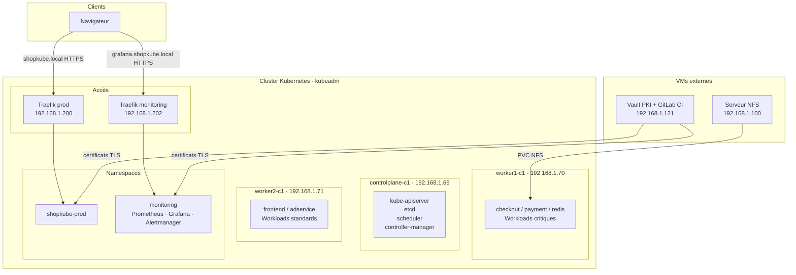

# ShopKube Platform

ShopKube est un projet personnel de plateforme Kubernetes construite sur des machines virtuelles bare-metal. L'objectif est de reproduire un environnement de production réaliste en partant de zéro : provisioning des nœuds, déploiement d'une application microservices, gestion des certificats, packaging et observabilité.

L'application déployée est [microservices-demo](https://github.com/GoogleCloudPlatform/microservices-demo), un projet open-source de Google Cloud Platform (Online Boutique, 12 microservices). Tous les droits sur le code applicatif appartiennent à Google. Ce repository contient uniquement la plateforme Kubernetes construite autour de cette application.

## Architecture



## Stack technique

| Couche | Technologie |
|---|---|
| Cluster | Kubernetes v1.33, kubeadm, Ubuntu 22.04 |
| Provisioning | Ansible |
| CNI | Calico |
| Runtime | containerd |
| Load Balancer | MetalLB |
| Ingress | Traefik v3 |
| PKI et TLS | HashiCorp Vault, cert-manager |
| Stockage | NFS CSI Driver |
| Packaging | Helm v3 |
| Observabilite | Prometheus, Grafana, Alertmanager |
| GitOps | ArgoCD + GitLab CI (en cours) |
| Application | [microservices-demo](https://github.com/GoogleCloudPlatform/microservices-demo) (Google Cloud Platform) |

## Structure du repo

| Dossier | Contenu |
|---|---|
| `ansible/` | Provisioning automatisé du cluster (roles common et kubernetes, playbooks cluster et reset) |
| `infrastructure/metallb/` | IPAddressPool et L2Advertisement |
| `infrastructure/traefik/` | Values Helm pour les instances prod et monitoring |
| `infrastructure/cert-manager/` | ClusterIssuer pointant vers Vault |
| `infrastructure/vault/` | Configuration PKI et guide d'installation (VM hors cluster) |
| `infrastructure/nfs-csi/` | StorageClass dynamique |
| `helm/shopkube/` | Chart Helm complet des 12 microservices avec values prod et dev |
| `monitoring/` | kube-prometheus-stack, Ingress Grafana, Prometheus et Alertmanager |
| `docs/` | Documentation par module |

## Comment déployer

### Prérequis

Trois VMs Ubuntu 22.04 (1 control plane, 2 workers), Ansible installé sur la machine admin, Helm v3 et un accès SSH aux nœuds.

### 1. Provisionner le cluster

```bash
cd ansible
cp inventory/hosts.example.yaml inventory/hosts.yaml
# Renseigner les IPs dans hosts.yaml
ansible-playbook playbooks/cluster.yml
```

### 2. Installer l'infrastructure

```bash
# MetalLB
kubectl apply -f infrastructure/metallb/

# NFS CSI Driver
curl -skSL https://raw.githubusercontent.com/kubernetes-csi/csi-driver-nfs/master/deploy/install-driver.sh | bash -s master --
kubectl apply -f infrastructure/nfs-csi/

# Traefik
helm repo add traefik https://traefik.github.io/charts
helm install traefik traefik/traefik -n traefik --create-namespace

# cert-manager
kubectl apply -f https://github.com/cert-manager/cert-manager/releases/download/v1.17.2/cert-manager.yaml
kubectl apply -f infrastructure/cert-manager/
```

Pour Vault, voir [infrastructure/vault/README.md](infrastructure/vault/README.md).

### 3. Déployer ShopKube

```bash
helm install shopkube-prod ./helm/shopkube \
  -f helm/shopkube/values-prod.yaml \
  -n shopkube-prod --create-namespace
```

### 4. Installer le monitoring

```bash
helm repo add prometheus-community https://prometheus-community.github.io/helm-charts

helm install monitoring prometheus-community/kube-prometheus-stack \
  -f monitoring/prometheus-values.yaml \
  -n monitoring --create-namespace
```

## Points notables

Le scheduling est configuré pour isoler les workloads critiques (redis, checkout, payment) sur worker1 via des taints et tolerations. Le frontend est contraint sur worker2 via une node affinity. Le loadgenerator ne peut pas se retrouver sur le même nœud que le frontend grâce à une pod anti-affinity.

La PKI est gérée par Vault comme autorité de certification interne. Les certificats sont émis et renouvelés automatiquement par cert-manager via le Kubernetes auth method, sans token statique à gérer.

Le chart Helm supporte plusieurs environnements depuis un seul jeu de templates. Les contraintes de scheduling, le nombre de replicas et le hostname Ingress varient selon le fichier de values chargé.

Le monitoring est isolé de la production sur sa propre instance Traefik avec une IP dédiée, accessible via FQDN en HTTPS.

## Roadmap

- [x] Provisioning cluster avec Ansible
- [x] Stockage persistant NFS CSI
- [x] Scheduling avancé (Taints, Affinity, PriorityClass)
- [x] Ingress TLS avec Vault PKI et cert-manager
- [x] Chart Helm multi-environnement
- [x] Observabilite Prometheus, Grafana, Alertmanager
- [ ] Alerting (PrometheusRule)
- [ ] GitOps ArgoCD avec GitLab CI
- [ ] Autoscaling HPA et VPA
- [ ] Network Policies et RBAC
- [ ] Logs avec Loki

## Auteur

Eric, disponible sur [GitHub](https://github.com/Edkm7).
