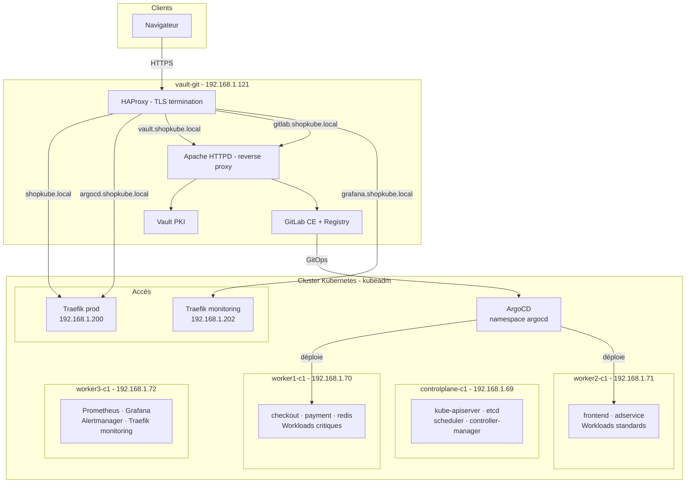

# ShopKube Platform

ShopKube est un projet personnel de plateforme Kubernetes construite sur des machines virtuelles bare-metal. L'objectif est de reproduire un environnement de production réaliste en partant de zéro : provisioning des nœuds, déploiement d'une application microservices, gestion des certificats, packaging, observabilité et GitOps.

L'application déployée est [microservices-demo](https://github.com/GoogleCloudPlatform/microservices-demo), un projet open-source de Google Cloud Platform (Online Boutique, 12 microservices). Tous les droits sur le code applicatif appartiennent à Google. Ce repository contient uniquement la plateforme Kubernetes construite autour de cette application.

## Infrastructure

Le projet s'appuie sur 6 machines virtuelles :

| VM | IP | Rôle |
|---|---|---|
| admin-vm | 192.168.1.100 | Machine d'administration (kubectl, Helm, Ansible) + serveur NFS |
| controlplane-c1 | 192.168.1.69 | Control plane Kubernetes |
| worker1-c1 | 192.168.1.70 | Worker — workloads critiques (taint dedicated=shopkube-critical) |
| worker2-c1 | 192.168.1.71 | Worker — frontend et workloads standards |
| worker3-c1 | 192.168.1.72 | Worker — monitoring dédié (taint dedicated=monitoring) |
| vault-git | 192.168.1.121 | HashiCorp Vault (CA PKI) · GitLab CE · GitLab Runner · GitLab Registry · Apache HTTPD (reverse proxy) · HAProxy (frontal TLS) |

Worker3-c1 a été ajouté pour isoler la stack de monitoring (Prometheus, Grafana, Alertmanager, Traefik monitoring) des workloads applicatifs. Cette séparation garantit que si un worker applicatif tombe, les outils de monitoring restent disponibles pour diagnostiquer le problème. Sans cette isolation, une panne de worker2-c1 aurait pu emporter Grafana et Prometheus en même temps que les pods ShopKube.

## Architecture



## Stack technique

| Couche | Technologie |
|---|---|
| Cluster | Kubernetes v1.33, kubeadm, Ubuntu 22.04 |
| Provisioning | Ansible |
| CNI | Calico |
| Runtime | containerd |
| Load Balancer | MetalLB |
| Ingress | Traefik v3 |
| PKI et TLS | HashiCorp Vault, cert-manager |
| Stockage | NFS CSI Driver |
| Packaging | Helm v3 |
| Observabilite | Prometheus, Grafana, Alertmanager |
| Alerting | PrometheusRule (23 règles), Slack |
| CI/CD | GitLab CE, GitLab Runner, GitLab Registry |
| GitOps | ArgoCD |
| Frontal réseau | HAProxy (TLS termination), Apache HTTPD (reverse proxy) |
| Application | [microservices-demo](https://github.com/GoogleCloudPlatform/microservices-demo) (Google Cloud Platform) |

## Structure du repo

| Dossier | Contenu |
|---|---|
| `ansible/` | Provisioning automatisé du cluster (roles common et kubernetes, playbooks cluster et reset) |
| `infrastructure/metallb/` | IPAddressPool et L2Advertisement |
| `infrastructure/traefik/` | Values Helm pour les instances prod et monitoring |
| `infrastructure/cert-manager/` | ClusterIssuer pointant vers Vault |
| `infrastructure/vault/` | Configuration PKI et guide d'installation (VM hors cluster) |
| `infrastructure/nfs-csi/` | StorageClass dynamique |
| `infrastructure/argocd/` | Ingress ArgoCD |
| `helm/shopkube/` | Chart Helm complet des 12 microservices avec values prod et dev |
| `monitoring/` | kube-prometheus-stack, Ingress Grafana, Prometheus et Alertmanager |
| `monitoring/alerts/` | PrometheusRules (nodes, workloads, storage, chain, traefik, monitoring) |
| `docs/` | Documentation par module |

## Comment déployer

Toutes les commandes ci-dessous s'exécutent depuis **admin-vm (192.168.1.100)**, qui dispose de kubectl, Helm et Ansible. Les commandes spécifiques à d'autres machines sont indiquées explicitement.

### Prérequis

Six VMs Ubuntu 22.04, Ansible installé sur admin-vm, Helm v3 et un accès SSH aux nœuds.

### 1. Provisionner le cluster

```bash
cd ansible
cp inventory/hosts.example.yaml inventory/hosts.yaml
# Renseigner les IPs dans hosts.yaml
ansible-playbook playbooks/cluster.yml
```

Pour ajouter un nœud worker après l'initialisation du cluster :

```bash
# Sur controlplane-c1
sudo sh -c 'echo "#!/bin/bash" > /tmp/kubeadm_join_cmd.sh && kubeadm token create --print-join-command >> /tmp/kubeadm_join_cmd.sh && chmod +x /tmp/kubeadm_join_cmd.sh'

# Depuis admin-vm
ansible-playbook playbooks/cluster.yml --limit worker3-c1
```

### 2. Installer l'infrastructure

```bash
# MetalLB
kubectl apply -f infrastructure/metallb/

# NFS CSI Driver
curl -skSL https://raw.githubusercontent.com/kubernetes-csi/csi-driver-nfs/master/deploy/install-driver.sh | bash -s master --
kubectl apply -f infrastructure/nfs-csi/

# Traefik prod
helm repo add traefik https://traefik.github.io/charts
helm install traefik traefik/traefik -n traefik --create-namespace \
  -f infrastructure/traefik/values-prod.yaml

# cert-manager
kubectl apply -f https://github.com/cert-manager/cert-manager/releases/download/v1.17.2/cert-manager.yaml
kubectl apply -f infrastructure/cert-manager/
```

Pour Vault, voir [infrastructure/vault/README.md](infrastructure/vault/README.md).

### 3. Déployer ShopKube

```bash
helm install shopkube-prod ./helm/shopkube \
  -f helm/shopkube/values-prod.yaml \
  -n shopkube-prod --create-namespace
```

### 4. Installer le monitoring

```bash
# Préparer worker3-c1
kubectl taint node worker3-c1 dedicated=monitoring:NoSchedule
kubectl label node worker3-c1 role=monitoring

helm repo add prometheus-community https://prometheus-community.github.io/helm-charts
helm install monitoring prometheus-community/kube-prometheus-stack \
  -f monitoring/prometheus-values.yaml \
  -n monitoring --create-namespace

# Traefik dédié au monitoring
helm install traefik-monitoring traefik/traefik \
  --namespace monitoring \
  --set service.type=LoadBalancer \
  --set providers.kubernetesIngress.ingressClass=traefik-monitoring \
  --set tolerations[0].key=dedicated \
  --set tolerations[0].operator=Equal \
  --set tolerations[0].value=monitoring \
  --set tolerations[0].effect=NoSchedule \
  --set nodeSelector.role=monitoring

# Appliquer les Ingress et les alerting rules
kubectl apply -f monitoring/ingress/
kubectl apply -f monitoring/alerts/
```

### 5. Installer ArgoCD

```bash
kubectl create namespace argocd
kubectl apply -n argocd -f https://raw.githubusercontent.com/argoproj/argo-cd/stable/manifests/install.yaml
kubectl apply -f infrastructure/argocd/
```

## Points notables

Le scheduling est configuré pour isoler les workloads critiques (redis, checkout, payment) sur worker1 via des taints et tolerations. Le frontend est contraint sur worker2 via une node affinity. Le loadgenerator ne peut pas se retrouver sur le même nœud que le frontend grâce à une pod anti-affinity.

La PKI est gérée par Vault comme autorité de certification interne. Les certificats sont émis et renouvelés automatiquement par cert-manager via le Kubernetes auth method, sans token statique à gérer.

Le chart Helm supporte plusieurs environnements depuis un seul jeu de templates. Les contraintes de scheduling, le nombre de replicas et le hostname Ingress varient selon le fichier de values chargé.

Le monitoring est isolé sur worker3-c1 avec sa propre instance Traefik (192.168.1.202), séparé des workloads applicatifs sur worker1 et worker2. 23 règles d'alerting PrometheusRule envoient les notifications vers Slack.

Le pipeline GitOps est opérationnel : GitLab CI build et scanne les images avec Trivy, les pousse dans le GitLab Registry, met à jour le tag dans le repo GitOps, et ArgoCD déploie automatiquement avec self-heal.

HAProxy sur vault-git est le point d'entrée TLS unique pour tous les services — ShopKube, Vault, GitLab, ArgoCD et Grafana sont tous accessibles via HTTPS sur leur propre FQDN.

## Roadmap

- [x] Provisioning cluster avec Ansible
- [x] Stockage persistant NFS CSI
- [x] Scheduling avancé (Taints, Affinity, PriorityClass)
- [x] Ingress TLS avec Vault PKI et cert-manager
- [x] Chart Helm multi-environnement
- [x] Observabilite Prometheus, Grafana, Alertmanager sur nœud dédié
- [x] Alerting PrometheusRule (23 règles) avec notifications Slack
- [x] GitOps ArgoCD avec GitLab CI et scan Trivy
- [x] Frontal réseau HAProxy + Apache HTTPD
- [x] Tomcat + JBoss dans legacy-apps (JPetStore + Kitchensink via GitOps)
- [ ] Autoscaling HPA et VPA
- [ ] Network Policies et RBAC
- [ ] Logs avec Loki

## Auteur
_Eric, disponible sur [GitHub](https://github.com/Edkm7) et [Linkedin](https://www.linkedin.com/in/eric-dacier-8a3b2518a/)_
